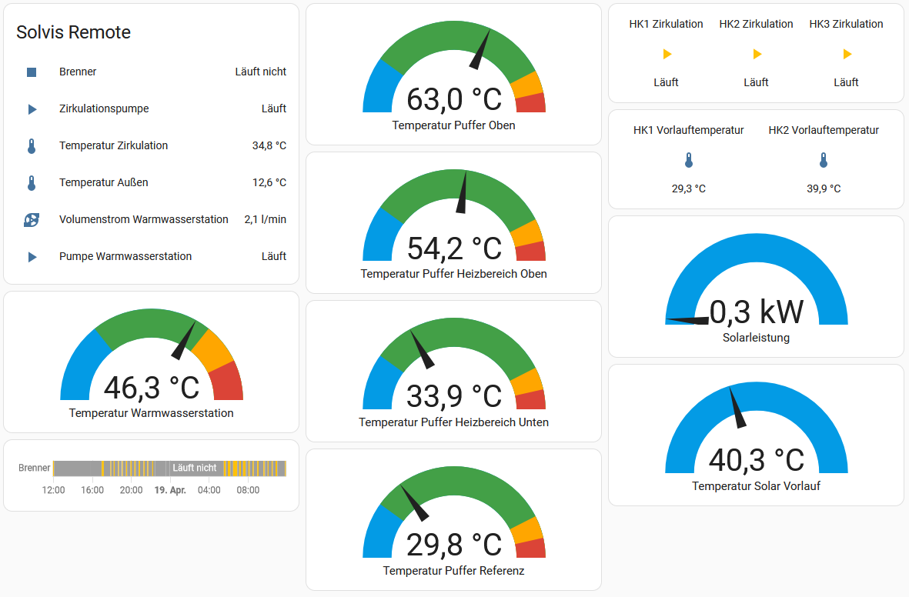
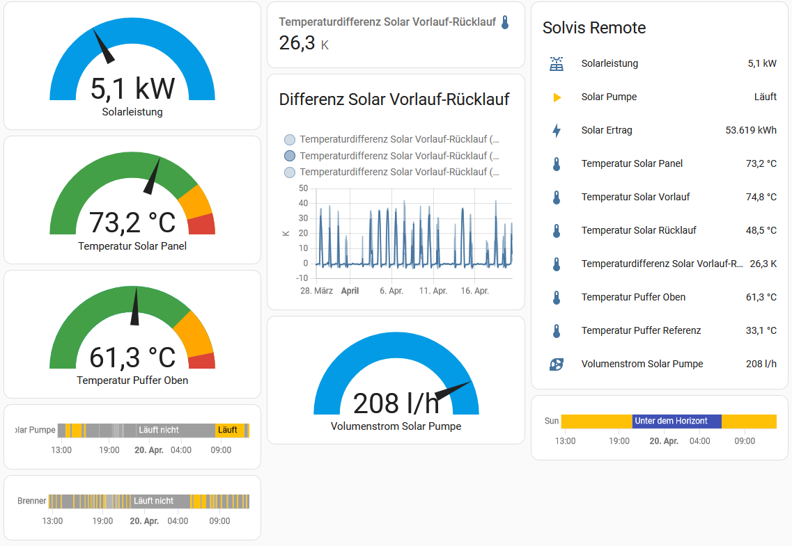

#  HA [Solvis](http://www.solvis.de) Heating custom component

[![GitHub Release][releases-shield]][releases]
[![License][license-shield]](LICENSE)

[![pre-commit][pre-commit-shield]][pre-commit]

## Important note: troubleshooting
If you don't manage to get the data from your heating device, please [enable debug logging](#debug-logging) and `log_response`. This will provide you with information for continued investigation. 

If all of this doesn't help, use the home assistant forum. I cannot give everyone personal assistance and please don't create github issues unless you are sure there is a bug.
Check the [wiki](https://github.com/Lurchi70/ha-solvis-heating/wiki) for help and other details on the functionality of this component.

# Introduction
The `solvis_heating` custom component uses the XML datainterface of the solvis remote extension of the heating system. 
The [Solvis](http://www.solvis.de) Heating Device is providing a lot of information about its state. To access this information the Heating device must be acessible via a computer network. [Solvis](http://www.solvis.de) provides the solvis remote as an additional device to make the heating available. Beside the officially documented http interface, the remote also provides an xml interface. 
This allows you to get details from your [Solvis](http://www.solvis.de) Heating device and integrate these into your Home Assistant installation.

Before being able to use the integration, you have to own a solvis remote device and have it attached, configured and available in your network. The communication with solvice remote and decoding of the returned data is done by the pypi package [sc2xmlreader](https://pypi.org/project/sc2xmlreader/). 

## XML interface vs. MODBUS Interface
Since Solvis SC2 Centralcontroller version MA205 (or higher) the data can be retrieved via the MODBUS interface (see [Solvis Heizung via Modbus auslesen und steuern](https://github.com/saruter/smarthome/blob/master/docs/projekte/solvis-heizung.md))

If you have an older Centralcontroller version, MODBUS is not available. But the XML Interface is available (currently i don't know since which version of SC2 - may be someone can tell me)

Due to my own heating system, I could only test the XML interface agains a SolvisMax 6 with Solvis Remote 200. 
As far as I know, it should be possible to use this against other system as well, as long as there is a Solvis Remote available.
## Sample integration into HA
The provided data can be integrated into HA Dashboard. 
Sample Dashboard for heating overview 


Sample Dashboard for solar details 


## integration into Energy Dashboard
Burner consumption and solar yield are also available in the energy dashboard (unfortunately und the label of "gas consumption" ...)
To add the values, just add "burner consumption" and "solar yield" to the dashboard:


...and the values will be part of the enery dashboard:

## Installation

[![hacs][hacsbadge]][hacs]
- Install the pypi package [sc2xmlreader](https://pypi.org/project/sc2xmlreader/) at your HA installation (prerequsite)
- Install manually by copying the files in 'custom_components/solvis_heating' to a new 'custom_components/solvis_heating' directory in HA config directory.
- Create 'customize.yaml' in config directory and add 
```
sensor.solvis_remote_volume_stream_solar:
  unit_of_measurement: 'l/h'

sensor.solvis_remote_volume_stream_warm_water:
  unit_of_measurement: 'l/min'
``` 
- Restart HA 
- In HA Setting - use "Add Integration" and search for Solvis
- Configure the integration test (ui configuration)
- Configure your dashboard

## Sensors
The following sensors are available:

| name                         | Unit   | Description   |
|------------------------------|--------|:-------------------------------------------|
| last_update                  |        | Time since latest data update.                |
| runtime_solar_pump           | h      | Total output runtime of the solar pump. |
| solar_power                  | W      | Current solarpower from the solar panels. |
| solar_pressure               | bar    | Current pressure in the solar pipes. |
| solar_yield                  | kWh    | Total yield of the solar panels to the heating system |
| temperature_buffer_reference | °C     | current refernce temperature in the buffer |
| temperature_H_buffer_top     | °C     | current temperature in the H buffer top |
| temperature_H_buffer_bottom  | °C     | current temperature in the H buffer bottom |
| temperature_circulation      | °C     | current temperature warm water circulation |
| temperature_heating_circuit_1_flow | °C     | current flow temperature heating circuit 1 |
| temperature_heating_circuit_2_flow | °C     | current flow temperature heating circuit 2 |
| temperature_outside          | °C     | current temperature out the building |
| temperature_solar_flow       | °C     | current flow temperature of solar heating  |
| temperature_solar_panel      | °C     | current temperature on the solar panel(s)  |
| temperature_solar_return     | °C     | current return temperature of solar heating  |
| volume_solar_pump            | l/h    | current volume of fluid stream in solar heating  |
| volume_warm_water            | l/min  | current volume of fluid stream in warm water station  |

## Binary Sensors
The following binary sensors are available:

| name                         | Description   |
|------------------------------|:-------------------------------------------|
| burner                       | oil/gas buner started. |
| burner_s2                    | oil/gas s2 buner started |
| circulation_pump             | warm water circulation pump running |
| heating_circuit_1_mixer_open | indicates that the heating circuit 1 increases the flow temperture |
| heating_circuit_1_mixer_close| indicates that the heating circuit 1 decreases the flow temperture |
| heating_circuit_1_pump       | heating circuit 1 pump is running |
| heating_circuit_2_mixer_open | indicates that the heating circuit 2 increases the flow temperture |
| heating_circuit_2_mixer_close| indicates that the heating circuit 2 decreases the flow temperture |
| heating_circuit_2_pump       | heating circuit 2 pump is running |
| heating_circuit_3_pump       | heating circuit 3 pump is running |
| recovery                     | recovery is active |
| solar_pump                   | solar pump is active |
| solar_2_pump                 | second solar pump is active |
| warm_water_station_pump      | warm water station pump is started |

## Known Issues
- Translation 
- Modbus integration as option instead of XML when SC is supporting that 
- Additional logging (debug / setup / missing components / configuration errors)
- Reconfigure of component
- Solvis Brand Icon
- assisted identification of Solvis Hardware

[commits]: https://github.com/Lurchi70/ha-solvis-heating/commits/main
[hacs]: https://hacs.xyz
[hacsbadge]: https://img.shields.io/badge/HACS-Default-orange.svg?style=for-the-badge
[discord]: https://discord.gg/Qa5fW2R
[discord-shield]: https://img.shields.io/discord/330944238910963714.svg?style=for-the-badge
[license-shield]: https://img.shields.io/github/license/Lurchi70/ha-solvis-heating?style=for-the-badge
[pre-commit]: https://github.com/pre-commit/pre-commit
[pre-commit-shield]: https://img.shields.io/badge/pre--commit-enabled-brightgreen?style=for-the-badge
[releases-shield]: https://img.shields.io/github/release/Lurchi70/ha-solvis-heating.svg?style=for-the-badge
[releases]: https://github.com/Lurchi70/ha-solvis-heating/releases
[user_profile]: https://github.com/Lurchi70
